# Final1：基于2DGS 与AIGC 的多源资产生成与真实场景融合

题目一完成一个完整的 3D 资产构建流程：使用 COLMAP + 2D Gaussian Splatting 重建真实多视角物体 Object A，使用 threestudio / DreamFusion 从文本生成 Object B，使用 Magic123 从单张真实图片生成 Object C，并使用 Mip-NeRF 360 的 garden 场景作为统一背景。最终将四类资产统一导入 Blender，完成尺度、位置和相机轨迹调整后输出多视角漫游视频。训练过程相关信息同步到 W&B，各阶段耗时记录到 report/timing.csv，运行入口封装为固定脚本，在 final1/ 目录下执行。

- GitHub Repo：https://github.com/hA0oooooo/FDU-computer-vision-26spring/tree/main/final1
- 模型权重与数字资产下载：https://drive.google.com/drive/folders/1nRW7w6xY1Dy_EY5k-Wd3xGI6H3KHcMxG?usp=sharing
- 多视角漫游渲染视频：https://drive.google.com/file/d/17vgmmyJAXXr9sq7nr6X-VkhohFKlJ_C1/view?usp=sharing

<p align="center">
  <video src="report/merge.mp4" controls width="720"></video>
</p>


### 1. 环境配置

##### Conda 环境

题目一使用一个统一环境 cvpj1 覆盖 2DGS、threestudio 和 Magic123：

```bash
cd final1
conda env create -f cvpj1.yml
conda activate cvpj1
```

由于所使用的服务器原因，每次进入环境后设置 CUDA 扩展编译变量：

```bash
export CUDA_HOME=$CONDA_PREFIX
export CUDA_PATH=$CONDA_PREFIX
export CUDACXX=$CONDA_PREFIX/bin/nvcc
export PATH=$CUDA_HOME/bin:$PATH
export LD_LIBRARY_PATH=$CUDA_HOME/lib:$CUDA_HOME/lib64:$LD_LIBRARY_PATH
export TORCH_CUDA_ARCH_LIST="8.6"
export TCNN_CUDA_ARCHITECTURES=86
```

- 2DGS 依赖 PyTorch 2.0、CUDA 11.8、diff-surfel-rasterization 和 simple-knn，用于显式高斯面片训练与 mesh 导出。
- threestudio 依赖 PyTorch Lightning、diffusers、xformers、nvdiffrast 和 tiny-cuda-nn，用于 DreamFusion / SDS 文本到 3D 生成。
- Magic123 依赖 diffusers、Zero123、MiDaS、rembg、xatlas 和若干 CUDA 扩展，用于单图到 3D 的 coarse-to-fine 优化。


Magic123 需要额外准备 MiDaS 与 Zero123 权重：

```bash
cd final1/Magic123

mkdir -p pretrained/midas
wget -c https://github.com/isl-org/MiDaS/releases/download/v3_1/dpt_beit_large_512.pt \
  -O pretrained/midas/dpt_beit_large_512.pt

mkdir -p pretrained/zero123
wget -c https://huggingface.co/cvlab/zero123-weights/resolve/main/105000.ckpt \
  -O pretrained/zero123/105000.ckpt
```

为了访问 Hugging Face，所使用的服务器代理端口设置为 127.0.0.1:9999，用于与个人笔记本建立反向代理，Object C 脚本中已写入该代理和 Hugging Face cache 路径。


##### Submodule 与 Patch

本目录依赖四个开源代码库作为 submodule：2d-gaussian-splatting、threestudio、Magic123 和 colmap，从仓库根目录克隆后执行：

```bash
git submodule update --init --recursive final1/2d-gaussian-splatting final1/threestudio final1/Magic123 final1/colmap
```

2DGS 需要一个很小的 alpha/mask patch，使透明前景图不会把透明区域下方 RGB 当成普通背景监督。Object A 脚本会在训练前自动检查并应用该 patch；如果希望提前手动应用，也可以执行：

```bash
cd final1
git -C 2d-gaussian-splatting apply ../patches/2d-gaussian-splatting-alpha-mask.patch
```


### 2. 数据准备

##### Mip-NeRF 360 背景场景

背景使用 Mip-NeRF 360 数据集中的 garden，数据下载后存放在：

```text
dataset/360_v2/<scene_name>
```

下载渠道使用官方公开数据包：

```bash
cd final1/dataset
wget -c http://storage.googleapis.com/gresearch/refraw360/360_v2.zip
wget -c http://storage.googleapis.com/gresearch/refraw360/360_extra_scenes.zip
unzip 360_v2.zip
unzip 360_extra_scenes.zip
```

dataset/360_v2/flowers.txt 和 dataset/360_v2/treehill.txt 是官方数据包中对受限场景的说明文件，表示这些场景不能直接公开分发，因此训练脚本实际读取的是包含 images/、images_2/、images_4/ 和 sparse/ 的场景目录，例如 dataset/360_v2/garden。


##### Object A（真实多视角物体）

Object A 的原始多视角照片位于 dataset/object_A/images_raw/，训练前使用 scripts/preprocess_image.py 对原始多视角照片进行预处理，首先调用 rembg 中的 bria-rmbg 前景分割模型，随后只保留面积最大的前景连通区域，以减少阴影、杂物或误分割区域的干扰，最后将结果保存为带透明通道的 RGBA PNG，输出在：

```text
dataset/object_A/images/
```

原始多视角样例：

<table>
  <tr>
    <td>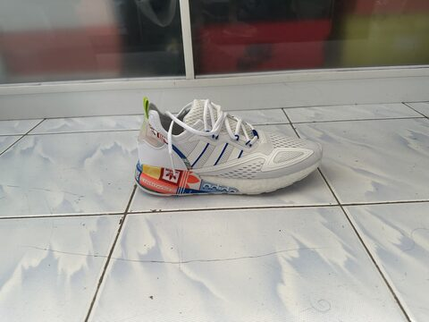</td>
    <td>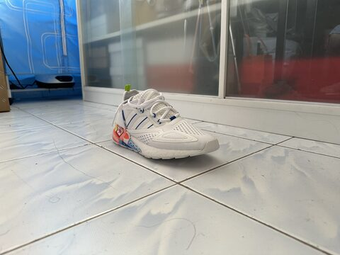</td>
    <td>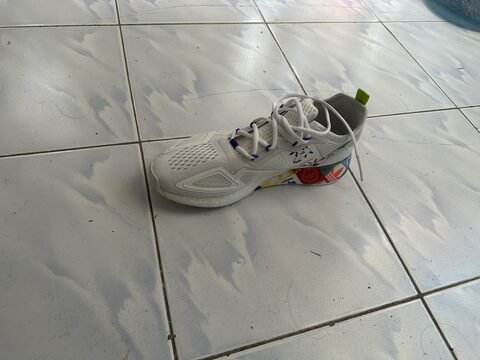</td>
  </tr>
  <tr>
    <td>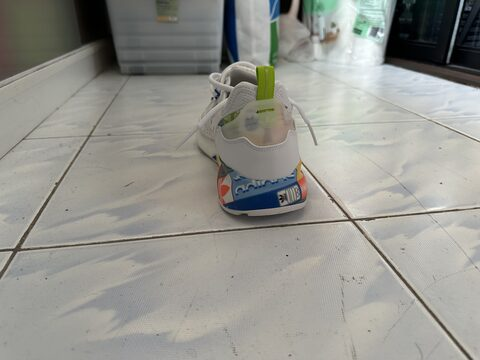</td>
    <td>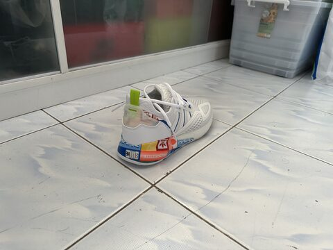</td>
    <td>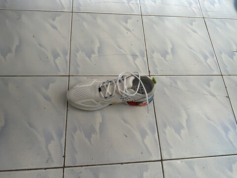</td>
  </tr>
  <tr>
    <td>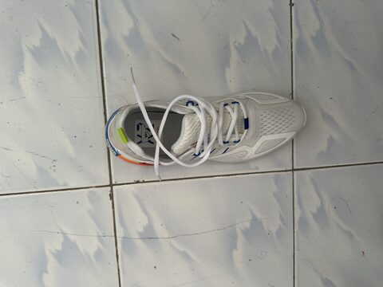</td>
    <td>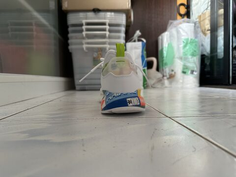</td>
    <td>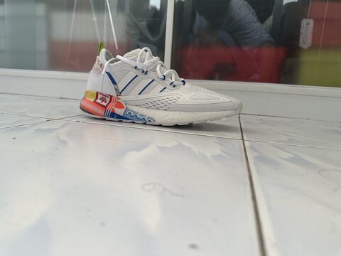</td>
  </tr>
</table>

预处理结果：

<table>
  <tr>
    <td>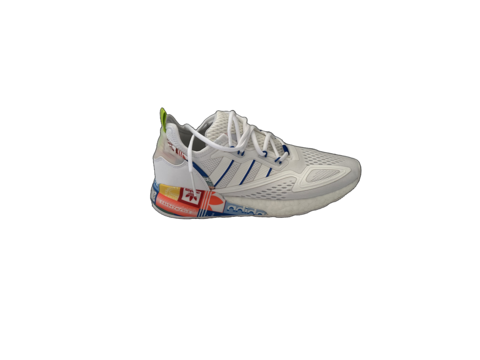</td>
    <td>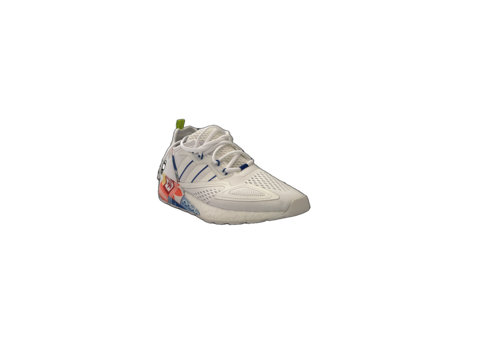</td>
    <td>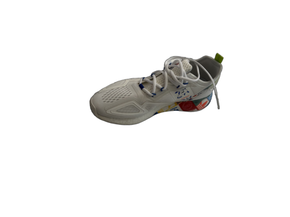</td>
  </tr>
  <tr>
    <td>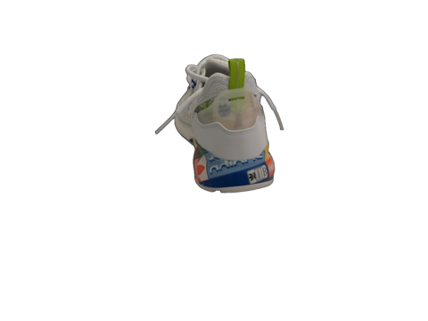</td>
    <td>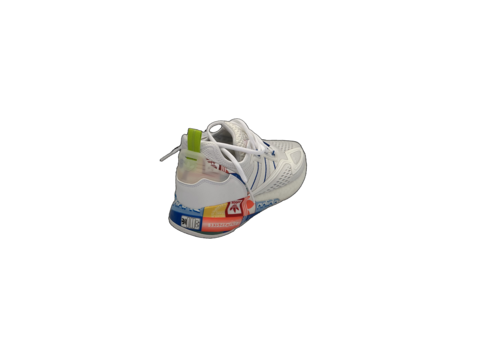</td>
    <td>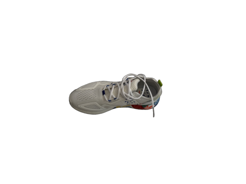</td>
  </tr>
  <tr>
    <td>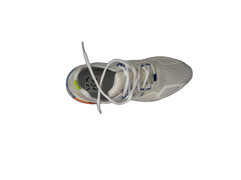</td>
    <td>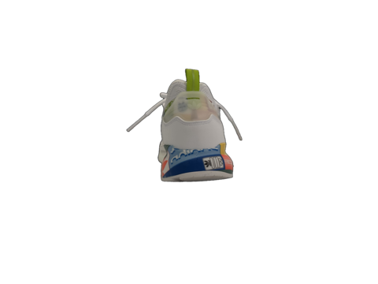</td>
    <td>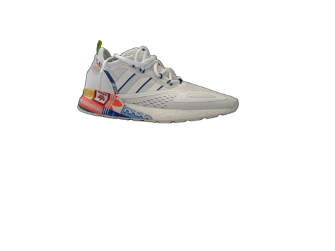</td>
  </tr>
</table>


##### Object B（文本到 3D 生成）

Object B 使用 threestudio 的 DreamFusion-SD 路线，不需要提前准备图像资产，使用的 prompt 和 negative prompt 为：

```bash
PROMPT="a zoomed out DSLR product photo of a single umbrella-shaped mushroom, one broad beige brown cap with subtle radial grooves, visible gills under the cap, one straight thick white stem with a small ring, full object, centered, clean silhouette, natural matte surface, detailed organic texture, plain background"
NEGATIVE_PROMPT="extra cap, extra stem, stacked body, multiple mushrooms, deformed, distorted, broken geometry, floating parts, messy background, cropped, blurry, text, watermark"
```

##### Object C（单图到 3D 生成）

Object C 使用一张手机拍摄图片作为输入，存放路径为 dataset/object_C/images/0001.jpg，脚本先使用预处理 scripts/preprocess_image.py 生成 0001_foreground.png，再由 Magic123/preprocess_image.py 生成 Magic123 训练所需的 rgba.png 和 depth.png。Object C 模式使用 soft alpha 并保留所有前景连通块，避免花朵、细枝等细结构被最大连通域过滤掉。

<table>
  <tr>
    <td>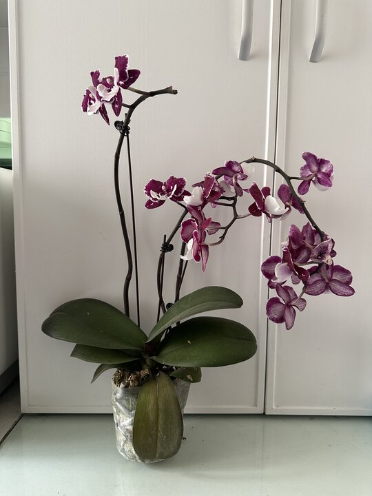<br>原始输入图</td>
    <td>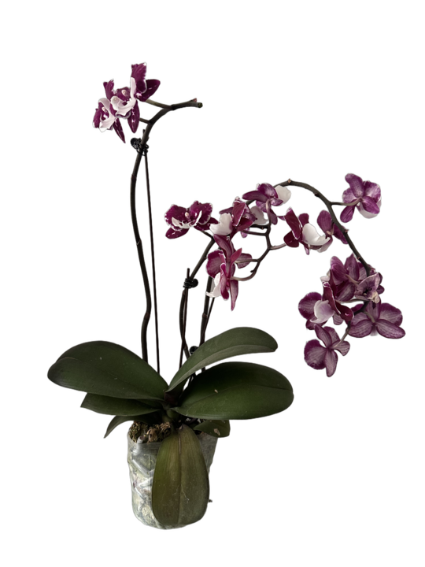<br>前景分割结果</td>
  </tr>
  <tr>
    <td>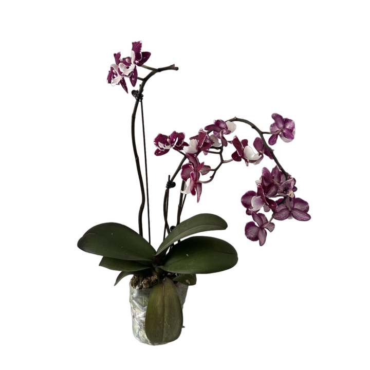<br>Magic123 RGBA 输入</td>
    <td>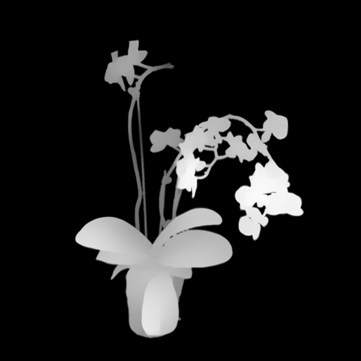<br>Magic123 depth 估计</td>
  </tr>
</table>

Object C 使用的 prompt 为：

```bash
TEXT_PROMPT="a high-resolution DSLR image of a single potted orchid plant with purple and white flowers,  \
broad green leaves, continuous thin dark branching stems visibly connecting every flower cluster to the plant, \
full object, centered, natural indoor plant texture"
```

### 3. 训练与测试

所有脚本都会将阶段耗时追加到 report/timing.csv，并在训练结束后上传关键指标到 W&B：

```text
entity=fudan-university-CS50028
project=final-project
```

##### COLMAP + 2DGS：Garden 与 Object A

2DGS 使用 COLMAP 位姿和多视角图像训练显式高斯面片，Object A 先用 COLMAP 从前景图估计相机位姿，再用 2DGS 训练并导出 fuse.ply / fuse_post.ply，背景场景直接使用 Mip-NeRF 360 数据集中已有的 COLMAP 结构。Object A 和背景 garden（或者其他场景）训练命令如下：

```bash
cd final1
bash scripts/run_objectA_colmap_2dgs.sh
bash scripts/run_background_2dgs.sh

bash scripts/run_background_2dgs.sh bicycle
bash scripts/run_background_2dgs.sh counter
```

##### threestudio / DreamFusion-SD：Object B

threestudio 通过 Stable Diffusion 2D prior 和 SDS loss，从文本 prompt 优化 3D 隐式表示，再导出带纹理的 mesh，开源模型使用 Stable Diffusion v1.5。Object B 训练命令如下：

```bash
cd final1
bash scripts/run_objectB_threestudio.sh
```

##### Magic123：Object C

Magic123 结合 Stable Diffusion 的 2D prior 与 Zero123 的 3D prior，脚本先训练 coarse 阶段，再从 coarse checkpoint 初始化 fine / DMTet 阶段，并导出最终 OBJ、MTL 和纹理文件。Object C 训练命令如下：

```bash
cd final1
bash scripts/run_objectC_magic123.sh
```


### 4. 场景融合与视频渲染

最终融合在 Blender 中完成，将不同来源的资产统一转换为显式 mesh 或点云代理：

- Garden：使用 2DGS 导出的 fuse_unbounded_post.ply
- Object A：使用 2DGS 导出的 fuse_post.ply
- Object B：使用 threestudio 导出的 OBJ、MTL 和纹理图片
- Object C：使用 Magic123 fine 阶段导出的 OBJ、MTL 和纹理图片

特别的，如果 Blender 导入 PLY 后未能显示出颜色属性，可复制脚本在 Blender 中使用，该脚本会将 PLY 的顶点颜色属性连接到材质的 Base Color：

```bash
scripts/blender_color.py
```