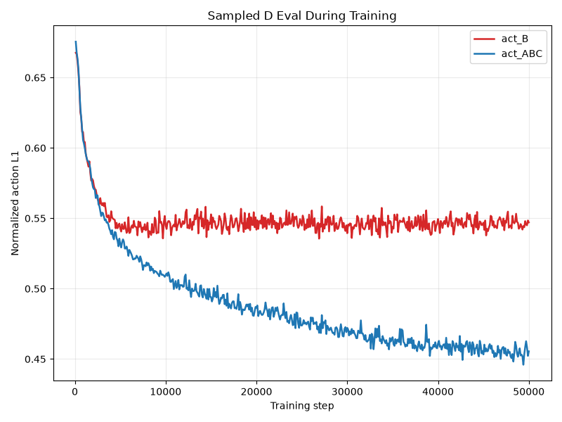
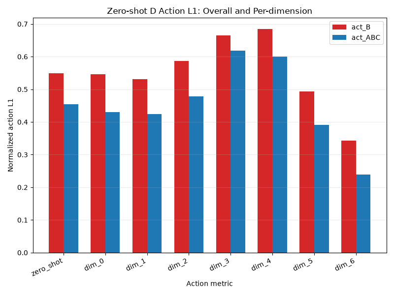
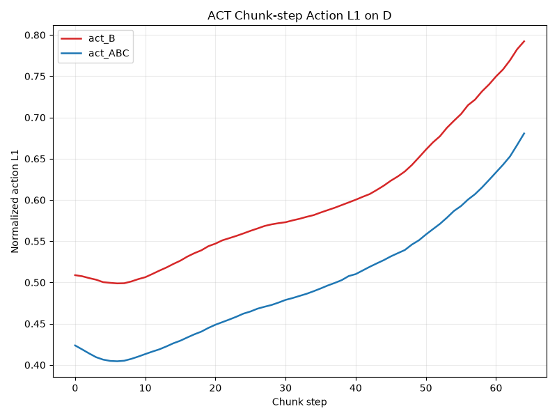

# Final2：基于 LeRobot 的 ACT 策略跨环境泛化挑战

题目二基于 LeRobot 中的 ACT（Action Chunking Transformer）策略，在 CALVIN 数据集上完成跨环境泛化实验：分别使用环境 B 数据训练 B-only ACT 策略，使用环境 A+B+C 混合数据训练 ABC-mixed ACT 策略，并在未见过的环境 D 上进行 zero-shot 离线动作误差评估。实验使用 WandB 记录训练曲线和训练中 D 环境 sampled eval 指标，并用本地图表分析最终动作误差、每个动作维度误差以及 ACT action chunk 内部不同预测步长的鲁棒性。

- GitHub Repo：https://github.com/hA0oooooo/FDU-computer-vision-26spring/tree/main/final2
- 模型权重下载链接：https://drive.google.com/drive/folders/1PgHYsOpj75ey_aXUm2H-doX79mWuZV2y?usp=sharing

<table>
  <tr>
    <td></td>
    <td></td>
    <td></td>
  </tr>
  <tr>
    <td align="center">训练中 D 环境 sampled eval</td>
    <td align="center">Zero-shot D 动作误差</td>
    <td align="center">Action Chunking 分析</td>
  </tr>
</table>

### 1. 环境配置

以下命令默认在仓库根目录下执行：

```bash
cd final2
conda env create -f cvpj2.yml
conda activate cvpj2
```

cvpj2.yml 固化了本实验使用的主要依赖版本，包括 Python 3.12.13、PyTorch 2.11.0、torchvision 0.26.0、LeRobot 0.5.2、WandB 0.24.2 和 matplotlib 3.11.0。训练和评测脚本会优先使用本目录下 lerobot/src 中的代码。

并请初始化 LeRobot submodule：

```bash
git submodule update --init --recursive final2/lerobot
```

另外，本实验在 LeRobot 训练入口上增加了 D 环境 sampled eval 和 action L1 统计逻辑，因此初始化 submodule 后需要应用 patch：

```bash
cd final2/lerobot
git apply ../patches/lerobot-act-d-eval.patch
```


### 2. 数据准备

本实验先从 Hugging Face 下载 huiwon/calvin_task_ABC_D 原始数据，再将四个环境分别转换为训练和评测所要求的 LeRobot v3.0 格式，最后将 A+B+C merge 成 ABC-mixed 训练集。数据划分如下：

- act_B：只使用环境 B 训练。
- act_ABC：使用环境 A+B+C 混合数据训练。
- 环境 D：只用于 zero-shot eval，不参与训练。

第一步，下载 Hugging Face 上的 CALVIN A/B/C/D 数据：

```bash
pip install -U "huggingface_hub[cli]"
hf auth login

hf download huiwon/calvin_task_ABC_D \
  --repo-type=dataset \
  --local-dir dataset/calvin_task_ABC_D
```

得到四个环境目录：

```text
dataset/calvin_task_ABC_D/
├── calvin_task_ABC_D_lerobot_0_4/   # 环境 A
├── calvin_task_ABC_D_lerobot_1_4/   # 环境 B
├── calvin_task_ABC_D_lerobot_2_4/   # 环境 C
└── calvin_task_ABC_D_lerobot_3_4/   # 环境 D
```

第二步，将四个环境从 LeRobot v2.1 数据格式转换到 v3.0：

```bash
cd final2/lerobot

BASE=../dataset/calvin_task_ABC_D

for i in 0 1 2 3; do
  python src/lerobot/scripts/convert_dataset_v21_to_v30.py \
    --repo-id calvin_task_ABC_D_lerobot_${i}_4 \
    --root "$BASE/calvin_task_ABC_D_lerobot_${i}_4" \
    --push-to-hub=false
done
```

第三步，合并 A+B+C，生成 ABC-mixed 训练集：

```bash
cd final2/lerobot

BASE=../dataset/calvin_task_ABC_D
OUT=../dataset/calvin_ABC_v30

lerobot-edit-dataset \
  --new_repo_id calvin_ABC_v30 \
  --new_root "$OUT" \
  --operation.type merge \
  --operation.repo_ids "['calvin_task_ABC_D_lerobot_0_4','calvin_task_ABC_D_lerobot_1_4','calvin_task_ABC_D_lerobot_2_4']" \
  --operation.roots "['$BASE/calvin_task_ABC_D_lerobot_0_4','$BASE/calvin_task_ABC_D_lerobot_1_4','$BASE/calvin_task_ABC_D_lerobot_2_4']" \
  --push_to_hub=false
```

最终训练和评测需要以下数据目录：

```text
dataset/
├── calvin_task_ABC_D/
│   ├── calvin_task_ABC_D_lerobot_0_4/   # A，参与 ABC merge
│   ├── calvin_task_ABC_D_lerobot_1_4/   # B，B-only 训练
│   ├── calvin_task_ABC_D_lerobot_2_4/   # C，参与 ABC merge
│   └── calvin_task_ABC_D_lerobot_3_4/   # D，只用于 zero-shot eval
└── calvin_ABC_v30/                      # A+B+C merge 后的训练集
```

### 3. 训练与评测

##### 训练 B-only ACT

```bash
cd final2
conda activate cvpj2
python scripts/train.py --config configs/train_b.yaml
```

##### 训练 ABC-mixed ACT

```bash
cd final2
conda activate cvpj2
python scripts/train.py --config configs/train_abc.yaml
```

两组训练使用相同 ACT 网络结构和主要超参数：steps=50000，batch_size=64，save_freq=10000，tolerance_s=0.001。

##### WandB 记录

训练过程记录到：

```text
entity=fudan-university-CS50028
project=final-project
run name=act_B / act_ABC
```

训练中每 100 step 会在环境 D 的固定 2048 个样本上做 sampled eval，并上传 WandB。

##### D 环境 full eval

训练完成后，对 50000 step checkpoint 做完整 D 环境离线评估：

```bash
cd final2
conda activate cvpj2
bash scripts/eval.sh --config configs/eval_b.yaml
bash scripts/eval.sh --config configs/eval_abc.yaml
```

主要指标：

- normalized_action_l1：整体动作误差，越低表示预测动作越接近专家动作。
- per_dimension_l1：7 个动作维度上的误差。
- chunk_step_l1：ACT 动作块内部不同 chunk step 的误差。
- chunk_summary：动作块前半段、后半段平均误差和退化比例。

##### 结果

<div align="center">

| Model | Train Env | Test Env | normalized_action_l1 | front_half_l1 | back_half_l1 | degradation_ratio |
| --- | --- | --- | ---: | ---: | ---: | ---: |
| act_B | B | D | 0.5499 | 0.5322 | 0.6597 | **1.2395** |
| act_ABC | A+B+C | D | **0.4547** | **0.4367** | **0.5585** | 1.2789 |

| Model | dim_0 | dim_1 | dim_2 | dim_3 | dim_4 | dim_5 | dim_6 |
| --- | ---: | ---: | ---: | ---: | ---: | ---: | ---: |
| act_B | 0.5461 | 0.5318 | 0.5865 | 0.6645 | 0.6845 | 0.4935 | 0.3423 |
| act_ABC | **0.4295** | **0.4247** | **0.4778** | **0.6187** | **0.6010** | **0.3914** | **0.2395** |

</div>

### 4. 可视化

生成本地图表：

```bash
cd final2
conda activate cvpj2
bash scripts/plot.sh
```

输出图表含义：

- compare_eval_history.png：训练过程中 D 环境 sampled eval 动作误差变化。
- compare_action_l1.png：zero-shot 总体动作误差和 7 个动作维度误差对比。
- compare_chunk_l1.png：ACT action chunk 内不同 chunk step 的动作误差对比。
- compare_chunk_summary.csv：动作块前半段、后半段误差及退化比例。
