# 任务 2：场景目标检测与视频多目标跟踪

本任务在 `mid2/` 中基于 Ultralytics YOLO 完成 VisDrone 航拍目标检测微调、视频流多目标跟踪、遮挡片段帧截取和越线计数。代码直接使用 `ultralytics.YOLO` 加载 COCO 预训练的 `yolov8s.pt`，之后在 VisDrone 检测数据集上微调得到 `yolov8s_finetuned.pt`。当前实验包含三类模型：原始 COCO 预训练 `yolov8s.pt` 基线、微调得到的 `yolov8s_finetuned.pt`、以及该数据集提供的 `yolov9_finetuned.pt` 模型。训练过程相关信息由 W&B 记录。


- GitHub Repo：`https://github.com/hA0oooooo/FDU-computer-vision-26spring/tree/main/mid2`

- 模型权重下载链接：`https://drive.google.com/drive/folders/17WLkZlMQYf6bIvRglwmK0k7A6E7RHFEj?usp=sharing`

<table>
  <tr>
    <td>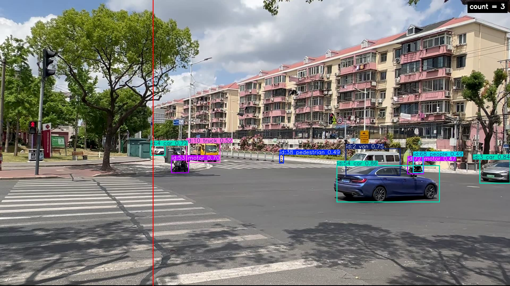</td>
    <td>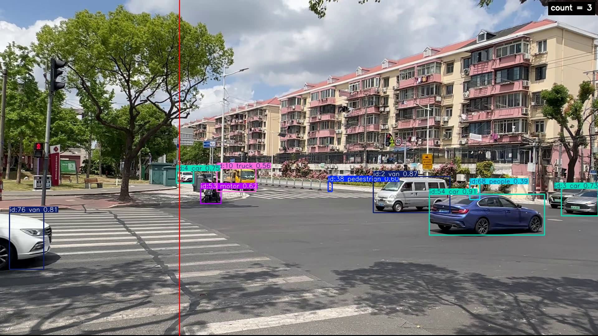</td>
  </tr>
  <tr>
    <td>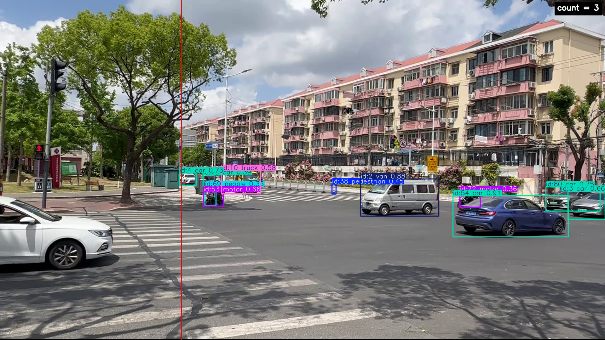</td>
    <td>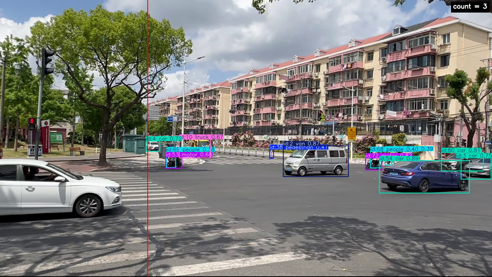</td>
  </tr>
</table>

* id: 54, 68, 72


<table>
  <tr>
    <td>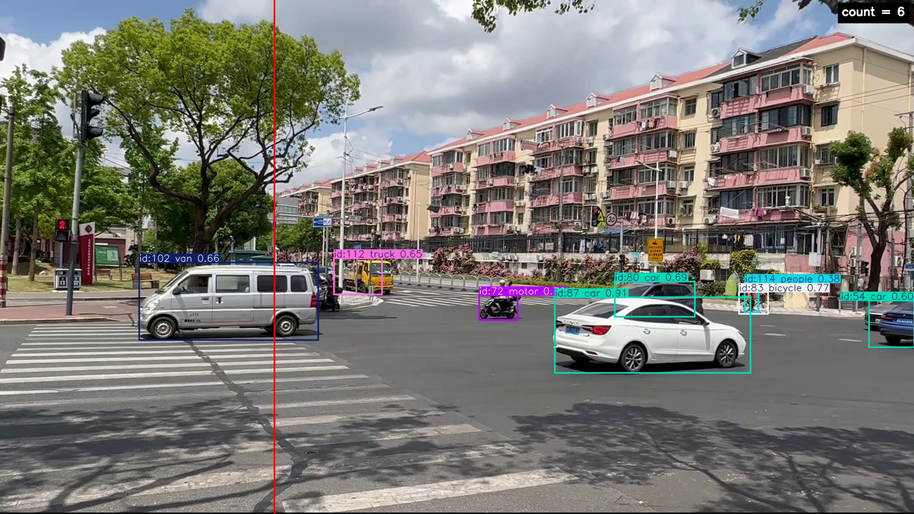<br></td>
    <td>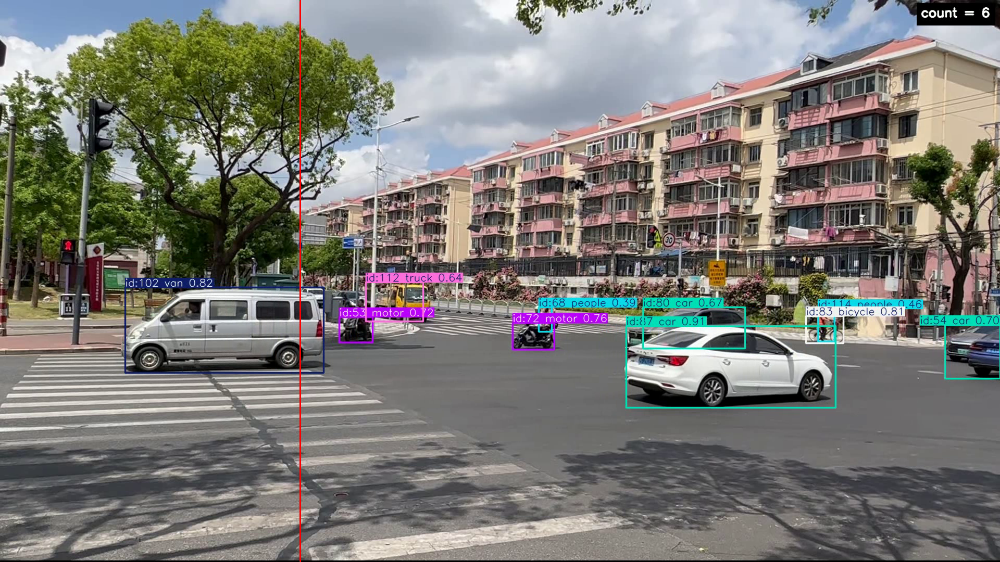<br></td>
  </tr>
  <tr>
    <td>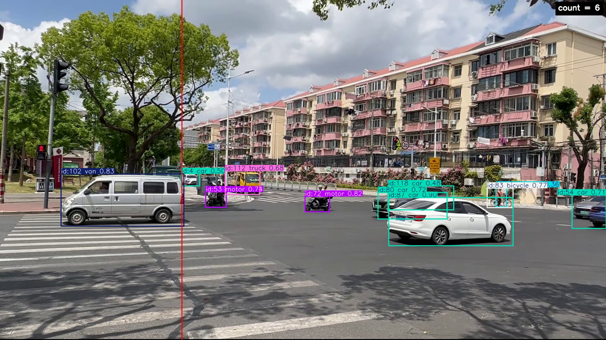<br></td>
    <td>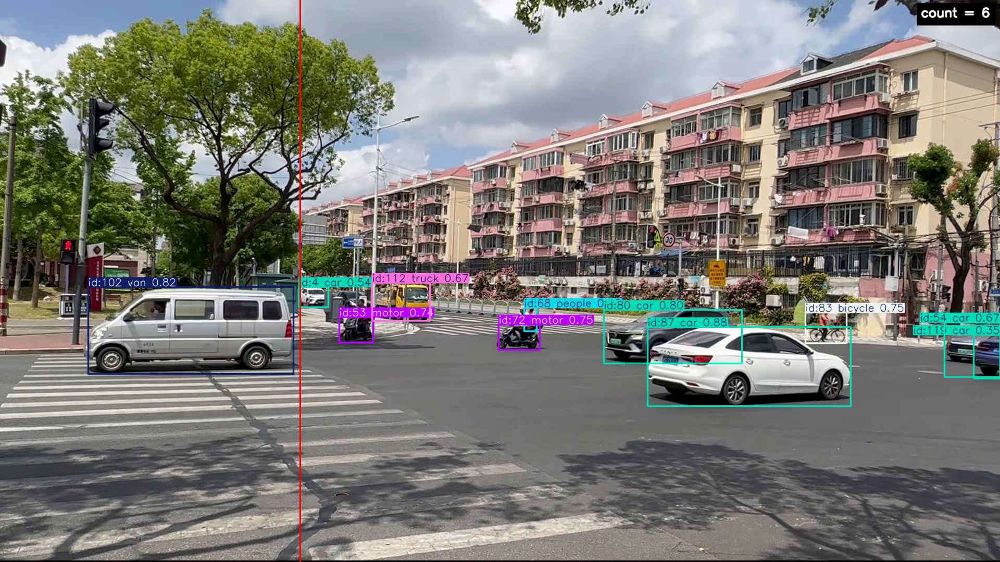<br></td>
  </tr>
</table>

* id: 80, 87, 118


<table>
  <tr>
    <td>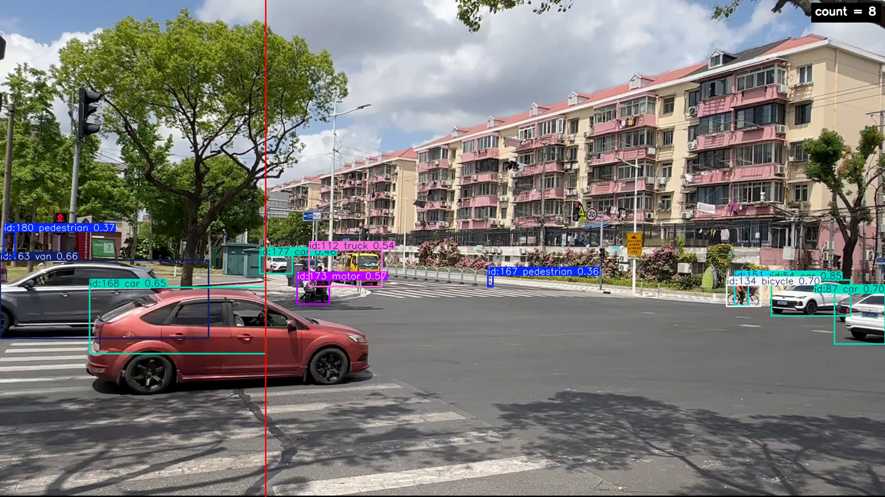<br></td>
    <td>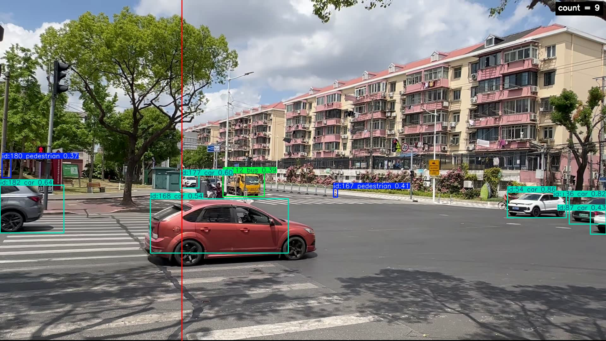<br></td>
  </tr>
  <tr>
    <td>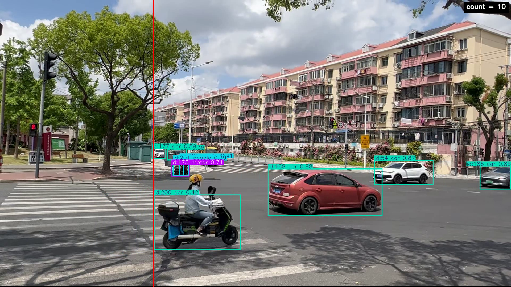<br></td>
    <td>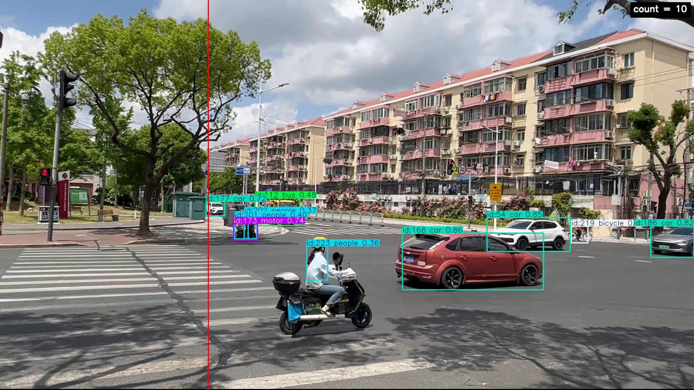<br></td>
  </tr>
</table>

* id: 54, 134, 151, 219


### 1. 环境依赖

建议使用 Python 3.9+。如果本机有 CUDA 环境，优先按自己的显卡和 CUDA 版本安装 PyTorch，再安装其余依赖：

```bash
pip install torch torchvision torchaudio --index-url https://download.pytorch.org/whl/cu126
pip install -r requirements.txt
```

训练过程使用 W&B 记录,首次使用前需要登录：

```bash
wandb login
```


### 2. 数据准备

VisDrone 数据集位于仓库根目录的 `dataset/VisDrone/`：

```text
dataset/VisDrone/
├── VisDrone2019-DET-train/
│   ├── annotations/
│   ├── images/
├── VisDrone2019-DET-val/
│   ├── annotations/
│   ├── images/
├── VisDrone2019-DET-test-dev/
│   ├── annotations/
│   ├── images/
├── images/
│   ├── train/
│   ├── val/
│   └── test/
├── labels/
│   ├── train/
│   ├── val/
│   └── test/
├── data.yaml
├── yolov8s.pt
└── yolov9_finetuned.pt
```

`VisDrone2019-DET-*` 是原始数据，`images/` 和 `labels/` 是 Ultralytics 训练需要的 YOLO 格式数据。若本地只有原始 `annotations/`，可先运行转换脚本：

```bash
cd mid2
python -m src.convert_visdrone
```

测试视频和视频推理结果：

```text
dataset/videos/input/
dataset/videos/output/
```

### 3. 项目结构

- `configs/`：YOLOv8s 微调配置和视频流检测相关配置
- `src/`：数据转换、训练、评估、视频跟踪、越线计数和帧截取源码
- `outputs/`：模型权重、验证结果 CSV、tracking CSV 和越线计数 YAML
- `reports/`：训练曲线和遮挡片段帧图

主要源码文件：

- `src/convert_visdrone.py`：将 VisDrone 原始 `annotations/` 转换为 YOLO 格式 `labels/`
- `src/train_yolo.py`：基于 COCO 预训练 `yolov8s.pt` 在 VisDrone 上微调，并保存 `yolov8s_finetuned.pt`
- `src/val_yolo.py`：评估 `yolov8s`、`yolov8s_finetuned` 和 `yolov9_finetuned`，输出 precision、recall、mAP50 和 mAP50-95
- `src/track_video.py`：视频流检测与多目标追踪、越线计数和合成视频输出
- `src/extract_frames.py`：按指定帧号从视频中截取画面
- `src/utils.py`：工具函数
- `src/wandb_utils.py`：W&B 初始化和训练日志记录

主要配置文件：

- `configs/visdrone_yolov8s.yaml`：YOLOv8s 微调配置
- `configs/track_line_count.yaml`：视频流检测置信度阈值、NMS IoU和越线位置等配置

具体训练、验证和视频推理参数均以对应 `configs/*.yaml` 为准。


### 4. 训练与测试

基于 VisDrone 航拍目标检测微调训练 YOLOv8s：

```bash
python -m src.train_yolo
```

评估三组模型：

```bash
python -m src.val_yolo --model yolov8s
python -m src.val_yolo --model yolov8s_finetuned
python -m src.val_yolo --model yolov9_finetuned
```


### 5. 视频流检测

使用微调后的 YOLOv8s 和 YOLOv9 进行视频流检测与多目标跟踪与越线计数：

```bash
python -m src.track_video --model yolov8s_finetuned --source ../dataset/videos/input/001.mp4
python -m src.track_video --model yolov9_finetuned --source ../dataset/videos/input/001.mp4
```

输出：

```text
../dataset/videos/output/001_yolov8s_finetuned.mp4
outputs/yolov8s/001_yolov8s_finetuned.csv
outputs/yolov8s/line_count.yaml

../dataset/videos/output/001_yolov9_finetuned.mp4
outputs/yolov9/001_yolov9_finetuned.csv
```

越线位置在 `configs/track_line_count.yaml` 中控制：`axis: x` 表示竖线，按目标中心点 `cx` 判断左右穿越；`axis: y` 表示横线，按 `cy` 判断上下穿越。`position` 小于等于 1 时表示比例位置，大于 1 时表示像素坐标。截取遮挡或密集交汇片段时，先在输出视频和视频流检测结果文件中确定帧号（例如 101、102、103、104），再运行：

```bash
python -m src.extract_frames --source ../dataset/videos/output/001_yolov8s_finetuned.mp4 --frames 101 102 103 104
```
