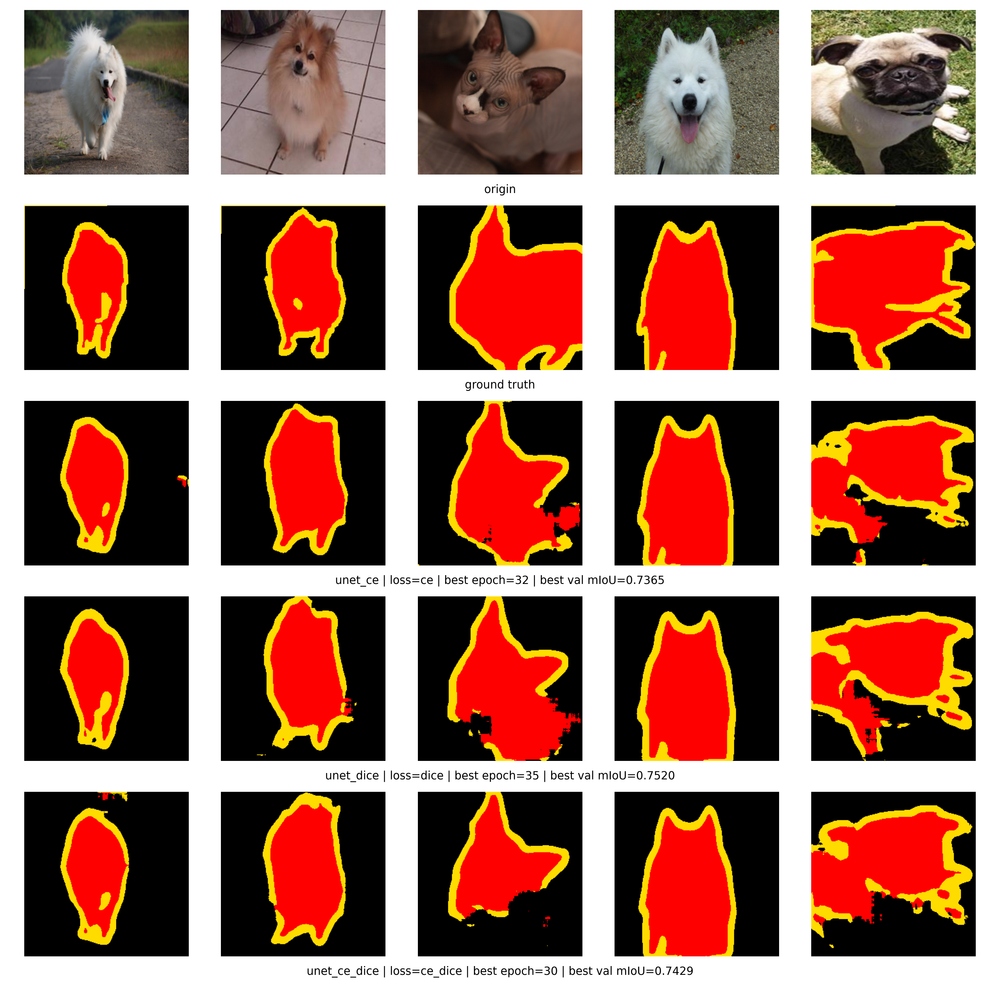

# 任务 3：Oxford-IIIT Pet 三分类语义分割

本任务在 `mid3/` 目录下实现从零训练的 U-Net，用于 Oxford-IIIT Pet 数据集的三分类 trimap 语义分割。代码读取 `images/` 和 `annotations/trimaps/`，将 trimap 标签 `1/2/3` 映射为 `0/1/2`，在固定验证集上比较不同损失函数的分割效果。

当前实现包含三组实验：`Cross-Entropy Loss`、`Dice Loss`、`Cross-Entropy + Dice Loss`。三组实验使用相同的 U-Net 结构、相同的数据划分和相同训练配置，模型全部随机初始化，不使用预训练权重，也不使用现成语义分割库。训练过程保存相关训练信息，并通过 W&B 记录 loss、pixel accuracy、mIoU 和三类 IoU。评估结果统一追加写入 `outputs/eval.csv`。可视化脚本支持生成单模型预测示例图和三模型对比图。

- GitHub Repo：`https://github.com/hA0oooooo/FDU-computer-vision-26spring/tree/main/mid3`

- 模型权重下载：`https://drive.google.com/drive/folders/17Y7ObYIbXXUfUXOja6rCe3f0SmxdchHk?usp=sharing`



### 1. 环境依赖

建议使用 Python 3.9+。先安装 PyTorch，CUDA 版本根据本机环境选择，再安装其余依赖：

```bash
pip install torch torchvision
pip install -r requirements.txt
```

使用 W&B 记录训练过程，W&B 项目和 entity 在 `configs/*.yaml` 中配置。首次使用前登录：

```bash
wandb login
```


### 2. 数据准备

数据集目录位于仓库根目录的 `dataset/oxford-iiit-pet/`，配置文件中的读取路径为：

```text
dataset/oxford-iiit-pet/
├── images/
│   └── xxx.jpg
├── annotations/
│   ├── trimaps/
│   │   └── xxx.png
│   ├── trainval.txt
│   └── test.txt
└── splits/
```

代码只使用 `images/`、`annotations/trimaps/`、`annotations/trainval.txt` 和 `annotations/test.txt`，官方 `trainval.txt` 会按 `seed=42` 和 `val_ratio=0.2` 固定划分为训练集和验证集：

```text
../dataset/oxford-iiit-pet/splits/trainval_seed42_val0.2.json
```


### 3. 项目结构

- `configs/`：三组实验配置文件
- `src/`：训练、评估、模型、损失函数、指标和可视化源码
- `outputs/`：训练输出、评估结果、checkpoint 和可视化图片

主要源码文件：

- `src/dataset.py`：Oxford-IIIT Pet trimap 分割数据集读取、resize、归一化和固定划分
- `src/model_unet.py`：从零实现的 U-Net，包括 encoder、decoder 和 skip connection
- `src/losses.py`：CE、Dice、CE+Dice 三种损失函数
- `src/metrics.py`：pixel accuracy、mIoU、foreground/background/boundary IoU
- `src/train.py`：训练主流程，并记录 W&B
- `src/eval.py`：评估，并写入 `outputs/eval.csv`
- `src/single_visualize.py`：单模型预测示例图
- `src/compare_visualize.py`：三种损失模型的预测对比图
- `src/utils.py`：工具函数
- `src/wandb_utils.py`：W&B 初始化和训练日志记录

主要配置文件：

- `configs/unet_ce.yaml`：U-Net + Cross-Entropy Loss 随机初始化训练
- `configs/unet_dice.yaml`：U-Net + Dice Loss 随机初始化训练
- `configs/unet_ce_dice.yaml`：U-Net + Cross-Entropy Loss + Dice Loss 随机初始化训练

具体训练参数均以对应 `configs/*.yaml` 为准。


### 4. 训练与测试

训练三组实验：

```bash
python -m src.train --config configs/unet_ce.yaml
python -m src.train --config configs/unet_dice.yaml
python -m src.train --config configs/unet_ce_dice.yaml
```

在官方 test split 上评估时指定 `--split test`，默认评估 `val` split：

```bash
python -m src.eval --config configs/unet_ce.yaml --split test
python -m src.eval --config configs/unet_dice.yaml --split test
python -m src.eval --config configs/unet_ce_dice.yaml --split test
```

生成单模型预测示例图：

```bash
python -m src.single_visualize unet_ce
python -m src.single_visualize unet_dice
python -m src.single_visualize unet_ce_dice
```

生成三种损失模型的对比图：

```bash
python -m src.compare_visualize
```
